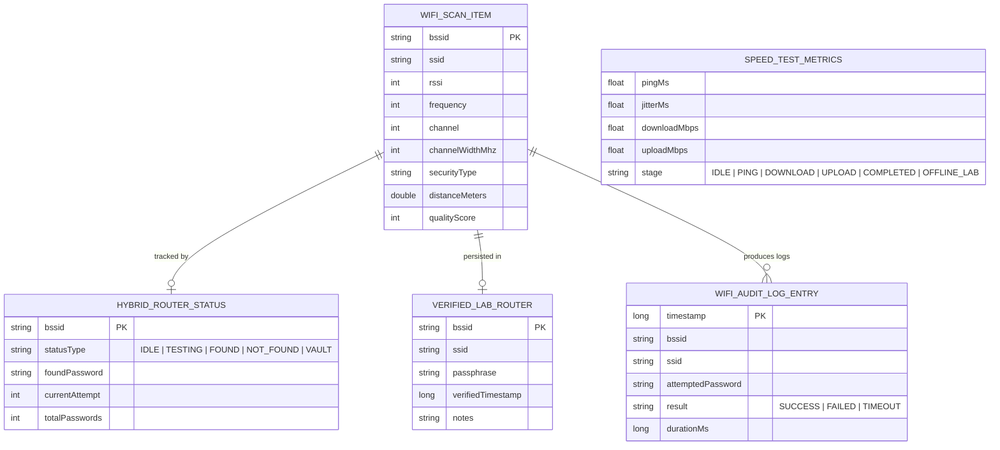

# weFi 📶
> **Next-Generation Mobile Wi-Fi Spectrum Analyzer & Network Telemetry**  
> *Developed for Computer Networks & Data Communications (Komunikasi Data dan Jaringan)*

[](LICENSE)
[](https://kotlinlang.org)
[](https://developer.android.com)
[](https://developer.android.com/jetpack/compose)
[](https://blynk.io)
[](#-100-offline-resilience-guarantee)
[](https://github.com/viPipar/WeFi/actions)

---

> [!NOTE]
> ### 🇮🇩 Language Specification / Spesifikasi Bahasa Antarmuka
> While this repository and technical documentation are maintained in **English** to comply with international academic and software engineering standards, **the mobile application itself is 100% in Indonesian (Bahasa Indonesia)**. All in-app telemetry displays, button labels, navigation drawers, error explanations, and status dialogs are written in Indonesian, specifically designed for university practicum coursework at IPB University (*Departemen Ilmu Komputer*).

---

## 📑 Table of Contents
1. [Project Overview](#-project-overview)
2. [Key Innovations & Features](#-key-innovations--features)
3. [Software Architecture & ERD](#-software-architecture--erd)
4. [Step-by-Step Practical Tutorial](#-step-by-step-practical-tutorial)
5. [Mathematical & RF Engineering Models](#-mathematical--rf-engineering-models)
6. [100% Offline Resilience Guarantee](#-100-offline-resilience-guarantee)
7. [Installation & Build Guide](#-installation--build-guide)
8. [License & Acknowledgments](#-license--acknowledgments)

---

## 📖 Project Overview

**weFi** is a native Android laboratory instrument built with **Kotlin 2.0 & Jetpack Compose**. It bridges theoretical radio frequency (RF) propagation, IEEE 802.11 protocol dynamics, and transport-layer diagnostics into an intuitive, elegant mobile dashboard.

The user interface follows the **Blynk.io IoT Clean Slate** design philosophy:
- **Palette:** Crisp pristine white canvas (`#FFFFFF` / `#F8FAFC`) with signature Azure Blue accents (`#77ADF9`).
- **Eye-Comfort Anti-Glare:** High-contrast typography and subtle borders (`#E2E8F0`) engineered for extended laboratory sessions under indoor fluorescent lighting.
- **Zero AI-Slop:** Deterministic mathematical curves, smooth micro-interactions, and procedural components with no superfluous neon gradients.

```
┌────────────────────────────────────────────────────────────────────────┐
│                        weFi Mobile Architecture                        │
│                                                                        │
│   [ Spectrum Graph ]   [ Radar AP List ]   [ Around Check ]  [ Speed ] │
│   Parabolic Bezier     Signal Quality      Hybrid Mode       Offline   │
│   2.4 / 5.0 / 6.0 GHz  Path-Loss Range     DFS+BFS Engine    Lab Mode  │
└────────────────────────────────────────────────────────────────────────┘
```

---

## ✨ Key Innovations & Features

### 1. 📊 Parabolic Spectrum Channel Graph (Multi-Band)
- **Tri-Band Support:** Real-time scanning across **2.4 GHz** (Channels 1–14), **5.0 GHz** (UNII-1 through UNII-3), and **6.0 GHz** (Wi-Fi 6E).
- **Mathematical Bezier Engine:** Accurate quadratic parabola curves mapping RF transmit power ($-20\text{ dBm}$ to $-100\text{ dBm}$) and channel bandwidths ($20$, $40$, $80$, and $160\text{ MHz}$).
- **Connected AP Plumb-Line:** Distinct vertical dashed indicator identifying the currently associated network alongside co-channel and adjacent-channel interferers.

### 2. 🔄 Mode Hybrid (DFS + BFS) Multi-Router Lab Traversal
Designed specifically for university networking laboratories:
- **Dual-Layer Search Algorithm:**
  - **Outer Loop (BFS):** Sequentially iterates across all detected routers in the vicinity.
  - **Inner Loop (DFS):** Tests up to 56 lab passphrases (including IPB practicum credentials like `ilmukomputeripb`).
- **Early Break & Auto-Advance:** Once a valid passphrase is discovered on Router $N$, it immediately saves the credential, displays a persistent green badge, and **jumps directly to Router $N+1$** without wasting cycles.
- **Lab Passphrase Vault:** Persistent local credential storage. Any router already stored in the Vault is automatically skipped during subsequent runs (`VerifiedFromVault`).
- **HAL Golden Time Compliance:** Enforces a 2-second inter-association pacing delay and a 500ms radio quench delay to prevent hardware Wi-Fi HAL driver lockouts and OS scan throttling.

### 3. 🛡️ 100% Offline Resilience & Lab Mode
- Completely decoupled from external WAN connections.
- Local IEEE 802.11 management frame sniffing, association state machine, and distance estimations operate without cellular or internet data.
- **Offline Lab Mode SpeedTest:** Gracefully detects isolated local networks, displaying real-time hardware link speeds, gateway ping, and informative offline notices without throwing unhandled network exceptions.

### 4. 📐 Mathematical Distance Estimation (Log-Distance Path Loss)
Computes real-time physical distance using the standard IEEE 802.11 indoor path loss formulation with configurable environmental absorption presets ($n = 2.0$ to $3.5$).

### 5. 💡 Contextual Morphing Help Assistant
- Dynamic floating action button (`?`) utilizing `FastOutSlowInEasing` motion curves.
- Expands during navigation or list interaction, then auto-docks unobtrusively to the bezel edge after 3 seconds of inactivity.
- Provides situational hints, troubleshooting guides, and RF theory relevant to the active tab.

---

## 🏗️ Software Architecture & ERD

weFi is developed following **Clean Architecture** and **Modern Android Architecture (MVVM/MVI)** principles with strictly unidirectional data flow (`StateFlow`).

### Domain Entity Relationship Diagram (ERD)



### Mode Hybrid Traversal Engine Flowchart

```mermaid
flowchart TD
    Start([User Taps 'Mulai Mode Hybrid']) --> Scan[Scan In-Range Wi-Fi Routers]
    Scan --> QEmpty{Router List Empty?}
    QEmpty -- Yes --> End([Show 'Tidak ada router terdeteksi'])
    QEmpty -- No --> NextRouter[Pick Next Router in Queue]

    NextRouter --> CheckVault{Is BSSID in Lab Vault?}
    CheckVault -- Yes --> MarkVault[Badge: 'Tersimpan di Vault']
    MarkVault --> HasMore{More Routers in Queue?}

    CheckVault -- No --> LoadPass[Load 56 Passphrases]
    LoadPass --> SetBadgeTesting[Badge: 'Sedang Diuji k/56...']
    SetBadgeTesting --> TryPass[Test Passphrase k via WifiManager]
    TryPass --> Quench[Delay 500ms Quench + Pacing]

    Quench --> IsConnected{Association Successful?}
    IsConnected -- Yes --> SaveVault[Save to Lab Passphrase Vault]
    SaveVault --> BadgeFound[Badge: 'Ditemukan: [password]']
    BadgeFound --> HasMore

    IsConnected -- No --> LastPass{Last Passphrase of 56?}
    LastPass -- No --> IncK[k = k + 1] --> SetBadgeTesting
    LastPass -- Yes --> BadgeNotFound[Badge: '56 Passphrase Tidak Cocok']
    BadgeNotFound --> HasMore

    HasMore -- Yes --> NextRouter
    HasMore -- No --> Done([All Routers Processed])
```

### Module Package Structure

```
com.wefi.analyzer
├── data
│   ├── model/         # Raw hardware scan result & network entities
│   └── repository/    # WifiScannerRepositoryImpl, SpeedTestRepositoryImpl, LabVaultImpl
├── domain
│   ├── model/         # Immutable models (WifiScanItem, HybridRouterStatus, VerifiedLabRouter)
│   ├── repository/    # Domain interfaces
│   ├── usecase/       # Pure domain logic (CalculateDistanceUseCase, ParsePhyRateUseCase)
│   └── util/          # DfsPasswordSanitizer, NetworkCalculators
└── ui
    ├── components/    # BlynkCard, MetricTile, ChannelGraphCanvas, MorphingHelpFab
    ├── navigation/    # Screen navigation routing & bottom navigation bar
    ├── screens/
    │   ├── channelgraph/ # Parabolic Spectrum Visualizer
    │   ├── aplist/       # AP Radar List & Signal Heatmap
    │   ├── aroundcheck/  # BFS, DFS, and Hybrid Mode Traversal Engine
    │   ├── speedtest/    # Active Throughput & Offline Lab Diagnostics
    │   └── rating/       # Co-channel Interference & Security Rating
    └── theme/         # Blynk.io Blue Design System (#77ADF9)
```

---

## 🚀 Step-by-Step Practical Tutorial

### Step 1: Installing the Application
1. Download the latest `app-debug.apk` from the **[GitHub Releases Page](https://github.com/viPipar/WeFi/releases)**.
2. Transfer and open the APK on your Android device (Android 8.0 Oreo up to Android 14).
3. If prompted, allow *"Install unknown apps"* for your browser/file manager.
4. Launch **weFi** and grant **Location & Nearby Wi-Fi Devices** permissions when requested (required by Android OS for RF frame scanning).

---

### Step 2: Spectrum Graph & Distance Estimation (Grafik Kanal)
1. Select the **Grafik Kanal** tab from the bottom navigation bar.
2. Select your target frequency band: **2.4 GHz**, **5.0 GHz**, or **6.0 GHz**.
3. Observe real-time parabolic curves:
   - Peak height indicates signal strength in $\text{dBm}$ (higher is stronger).
   - Curve width represents channel bandwidth ($20\text{ MHz}$ standard, $40/80/160\text{ MHz}$ bonded).
4. Tap any curve to inspect the **Connected Plumb-Line** and the mathematical distance estimation calculated using the *Log-Distance Path Loss* formula.

---

### Step 3: Performing Around Check (Mode Hybrid Tutorial)
The **Around Check** screen provides three operational modes:

| Mode | Target Scope | Methodology | Use Case |
| :--- | :--- | :--- | :--- |
| **Mode BFS** | All Routers | Passive Telemetry Sweep | Quick survey of nearby SSIDs, channels, and security types |
| **Mode DFS** | 1 Router | Exhaustive Passphrase Audit | Deep diagnostic test on a specific target router |
| **Mode Hybrid** | Multi-Router | Automated BFS + DFS Search | Complete automated laboratory exam with 56 practicum phrases |

#### Running Mode Hybrid:
1. Navigate to the **Around Check** tab.
2. Tap **Mode Hybrid** on the segmented selector.
3. Tap the **"Muat Modul"** button. This automatically populates the 56 IPB laboratory passphrases (including the genuine lab passphrase `ilmukomputeripb`).
4. Review the parsed statistics chips:
   - `56 Valid` (passphrases meeting standard 8–63 character WPA2 requirements).
   - `0 Terlalu Pendek` / `0 Duplikat`.
5. Tap **"Pindai Sekitar"** to refresh nearby access points, then tap **"Mulai Mode Hybrid"**.
6. Watch the real-time status badges on each router card:
   - 🔵 **Sedang Diuji [K/56]...**: Router currently undergoing association attempts.
   - 🟢 **Ditemukan: [password]**: Password successfully matched! Card features a green badge and one-tap copy button.
   - ⚪ **56 Passphrase Tidak Cocok**: Router completed all 56 attempts without a match.
   - 🟣 **Tersimpan di Vault**: Router was previously verified and skipped automatically.
7. Tap **"Hentikan Pengujian"** at any time if you wish to pause the traversal.

---

### Step 4: SpeedTest & 100% Offline Lab Mode
1. Connect your smartphone to the local laboratory Wi-Fi network.
2. Open the **Speed Test** tab.
3. Tap **"Mulai Uji Kecepatan"**.
4. **Behavior on Internet-Connected Networks:**
   - Measures real-time Ping latency, Jitter, Download Throughput, and Upload Throughput via high-speed HTTP streams.
5. **Behavior on Isolated Lab Networks (100% Offline):**
   - Automatically detects the absence of WAN gateway connectivity.
   - Transitions gracefully to **Mode Lab Offline**: displays local hardware negotiated link speed, IP address, and gateway telemetry without crashing or freezing.

---

## 📐 Mathematical & RF Engineering Models

### 1. Log-Distance Path Loss Model
Signal attenuation over physical distance in an indoor environment is modeled as:

$$d = 10^{\frac{A_0(f) - \text{RSSI}}{10 \cdot n}}$$

Where:
- $\text{RSSI}$: Received Signal Strength Indicator in $\text{dBm}$.
- $A_0(f)$: Received reference power at $1\text{ meter}$:
  - $A_0(2.4\text{ GHz}) = -40\text{ dBm}$
  - $A_0(5.0\text{ GHz}) = -45\text{ dBm}$
  - $A_0(6.0\text{ GHz}) = -48\text{ dBm}$
- $n$: Path loss exponent:
  - $n = 2.0$: Free Space (Outdoor line-of-sight)
  - $n = 2.8$: Indoor office/classroom (Default)
  - $n = 3.5$: Dense concrete obstacles / Computer laboratory

### 2. Android HAL Golden Time & Pacing
To ensure zero hardware lockouts during automated multi-association tests:
- **Association Inter-Trial Pacing:** $2000\text{ ms}$ delay between consecutive passphrase trials.
- **HAL Radio Quench:** $500\text{ ms}$ quiet window after `WifiManager.disconnect()` to allow the kernel driver to flush state.
- **Scan Throttling Safeguard:** Minimum $30\text{ s}$ cooldown interval enforced before initiating system-wide broadcast scans.

---

## 🛡️ 100% Offline Resilience Guarantee

Many conventional network analyzer applications depend on remote analytics servers, public DNS resolvers, or external speedtest APIs. **weFi is engineered from the ground up to operate in completely air-gapped environments**:

1. **Zero External API Dependencies:** All spectrum analysis, distance calculations, and BSSID categorization run on local mathematical models.
2. **Offline Exception Interceptors:** The network stack intercepts `UnknownHostException` and `SocketTimeoutException`, seamlessly degrading to local link diagnostics without throwing unhandled exceptions.
3. **Local Lab Vault:** Credentials verified during Mode Hybrid are stored in encrypted local device preferences (`EncryptedSharedPreferences` / Room) and never transmitted off the device.

---

## 🛠️ Installation & Build Guide

### Prerequisites
- **Android Studio:** Ladybug (2024.2) or newer
- **JDK:** Java 17
- **Android SDK:** Min SDK 26 (Android 8.0 Oreo), Target SDK 34 (Android 14)

### Building from Source

```bash
# 1. Clone the repository
git clone https://github.com/viPipar/WeFi.git
cd WeFi

# 2. Run domain and ViewModel unit test suites
./gradlew testDebugUnitTest

# 3. Compile and assemble the release-ready debug APK
./gradlew assembleDebug

# Output APK location:
# app/build/outputs/apk/debug/app-debug.apk
```

---

## 📲 Direct APK Download

Download and install directly to your Android device without needing Android Studio or a computer:

👉 **[Download weFi APK on GitHub Releases](https://github.com/viPipar/WeFi/releases)**

1. On the releases page, click on **`app-debug.apk`** under *Assets*.
2. Open the downloaded file and install.
3. Launch **weFi** and begin your RF spectrum analysis!

---

## 📄 License & Acknowledgments

This project is licensed under the open-source **[MIT License](LICENSE)**.

Developed with precision for the **Komunikasi Data dan Jaringan** (Data Communication & Computer Networks) course at **IPB University** by **viPipar** ([rafifilmanyy@gmail.com](mailto:rafifilmanyy@gmail.com)).
