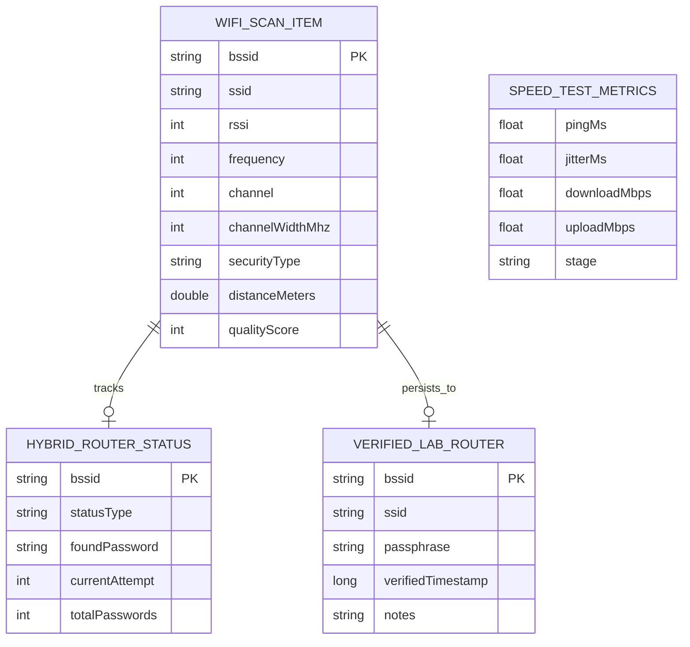

# weFi

Android Wi-Fi Spectrum Analyzer & Network Diagnostics tool developed for Computer Networks and Data Communications coursework at IPB University.

[](LICENSE)
[](https://kotlinlang.org)
[](https://developer.android.com)
[](https://developer.android.com/jetpack/compose)
[](https://github.com/viPipar/WeFi/releases)

---

> **Note on Application Language**  
> This documentation is written in English for standard technical reference. The mobile application user interface (menus, telemetry labels, buttons, and dialogs) is in **Indonesian (Bahasa Indonesia)**, designed specifically for hands-on networking laboratory sessions at IPB University.

---

## Overview

**weFi** is a native Android application built with Kotlin and Jetpack Compose. It allows students and network engineers to inspect Wi-Fi spectrum allocations, measure signal strength, estimate router distance using radio propagation models, test local association credentials, and benchmark throughput.

The UI uses a clean, high-contrast light theme inspired by Blynk.io (`#77ADF9` accents on white canvas) designed for readable telemetry in indoor lab environments.

---

## Features

### 1. Parabolic Spectrum Graph
- Scans and visualizes channel usage across **2.4 GHz**, **5.0 GHz**, and **6.0 GHz (Wi-Fi 6E)** bands.
- Renders parabolic signal curves representing transmit power (-20 dBm to -100 dBm) and channel bandwidths (20, 40, 80, 160 MHz).
- Displays a dashed vertical plumb-line on the currently connected network to quickly compare signal overlap with neighboring access points.

### 2. Distance Estimation
Calculates physical distance using the standard IEEE 802.11 indoor Log-Distance Path Loss model:

$$d = 10^{\frac{A_0(f) - \text{RSSI}}{10 \cdot n}}$$

- $A_0(f)$: Reference power at 1 meter (-40 dBm for 2.4 GHz, -45 dBm for 5.0 GHz).
- $n$: Environmental path loss exponent (Free space: 2.0, Indoor: 2.8, Dense obstacles: 3.5).

### 3. Around Check (Network Association Audit)
Offers three operational modes for testing Wi-Fi networks:

- **Mode BFS (Breadth-First Sweep):** Scans all in-range access points, showing real-time RSSI, frequency band, channel width, and security protocol (WPA2/WPA3).
- **Mode DFS (Depth-First Search):** Tests a list of passphrases against a single selected router. Includes an input sanitizer that strips whitespace, removes duplicates, and filters invalid entries (8–63 characters).
- **Mode Hybrid (BFS + DFS Traversal):** Automated multi-router audit designed for laboratory practicum exams:
  - Loads a built-in template of 56 lab passphrases (including the actual lab password `ilmukomputeripb`).
  - Iterates sequentially across all detected routers.
  - Tests passphrases on Router 1. If the password matches, it saves the credentials, marks the router with a green badge, and immediately proceeds to Router 2.
  - If all 56 attempts fail, it marks the router as "56 Passphrase Tidak Cocok" and advances to the next router.
  - Routers already verified in the local Vault are automatically skipped.
  - Complies with Android Wi-Fi HAL constraints (2-second inter-trial pacing and 500ms radio quench delay to prevent hardware lockouts).

### 4. Speed Test & 100% Offline Lab Mode
- On networks with internet access: measures real-time Ping latency, Jitter, Download throughput, and Upload throughput.
- On isolated lab networks without internet access: automatically detects the lack of WAN connection and activates **Mode Lab Offline**, displaying negotiated link speed, IP configuration, and gateway status without crashing or throwing unhandled exceptions.

### 5. Network Discovery & Lab Audit (Educational Observability)
A strictly read-only, non-root network discovery and topology enumeration module for isolated lab environments (e.g. lab routers and CCTV simulators):
- **Hybrid Ping Sweep:** Automatically calculates local subnet from `WifiManager.dhcpInfo`. Probes hosts using `InetAddress.isReachable()` with non-blocking fallback to TCP connect on ports 80, 443, 554, and 22 with a 32-coroutine concurrency limit (`Semaphore(32)`).
- **TCP Connect Port Scan:** Audits 13 standard lab ports (`22, 23, 53, 80, 443, 554, 8000, 8080, 8443, 3702, 37777, 5000, 8888`) with 500ms timeout per port and 64-coroutine concurrency. No SYN scan or root required.
- **mDNS & SSDP Discovery:** Uses Android's official `NsdManager` and UDP multicast (`239.255.255.250:1900` with `MulticastLock`) to discover broadcasted UPnP services, camera streams, and web consoles.
- **MAC OUI & Offline CVE Matching:** Identifies vendors using an offline IEEE OUI dataset (`assets/oui_database.csv`) and correlates identified services/firmware against a curated offline CVE snapshot (`assets/cve_catalog.json`) for informational auditing only.
- **Safety Throttling & Circuit Breaker:** Implements a token bucket rate-limiter (maximum 200 packets/second), 30-second per-host cooldown, and automated Circuit Breaker detection when client isolation prevents host discovery.
- **Export Engine:** One-tap export to structured JSON and human-readable audit text reports.

#### Android Technical Limitations & Mitigations
| Android Constraint | Technical Limitation | Mitigation / Architecture Solution |
| :--- | :--- | :--- |
| **Raw ICMP Sockets** | Android SELinux sandbox blocks non-root apps from creating raw ICMP sockets. | `InetAddress.isReachable()` with non-blocking TCP connect fallback to ports 80/443/554/22. |
| **ARP Cache Access** | Android 10+ (API 29+) restricts reading `/proc/net/arp` without root. | Fallback vendor identification via SSDP/mDNS service headers; best-effort ARP on legacy Android. |
| **Multicast Packet Filtering** | Chipset/kernel Wi-Fi power saver drops incoming multicast packets by default. | Explicitly acquire `WifiManager.MulticastLock` with `CHANGE_WIFI_MULTICAST_STATE` during SSDP. |
| **AP Client Isolation** | Strict lab access points may isolate wireless clients from observing peers. | Built-in circuit breaker heuristic warns user if 0 hosts are found, suggesting AP configuration review. |

---

## Architecture & Data Model

The application follows Clean Architecture with MVVM and unidirectional state flows (`StateFlow`).

```
com.wefi.analyzer
├── data/          # WifiManager hardware interop, OkHttp speed engine, Local Vault
├── domain/        # UseCases, data models, passphrase sanitizer logic
└── ui/            # Jetpack Compose screens, components, and theme
```

### Entity Relationship Diagram



---

## User Guide

### Installation
1. Go to the [Releases Page](https://github.com/viPipar/WeFi/releases).
2. Download `app-debug.apk` to your Android device (Android 8.0 or newer).
3. Tap the file to install (allow "Install from unknown sources" if prompted).
4. Grant Location and Nearby Devices permissions when opening the app (required by Android for Wi-Fi scanning).

### Using the Spectrum Graph
1. Open the **Grafik Kanal** tab.
2. Select the frequency band (2.4 GHz, 5.0 GHz, or 6.0 GHz).
3. View the parabolic curves representing active access points.
4. Tap any curve to view signal details and estimated distance.

### Running Mode Hybrid
1. Open the **Around Check** tab.
2. Tap the **Mode Hybrid** tab on the segmented bar.
3. Tap **Muat Modul** to load the 56 lab passphrases.
4. Tap **Pindai Sekitar** to detect in-range routers.
5. Tap **Mulai Mode Hybrid** to begin automated traversal.
6. The app tests each router sequentially and updates status cards in real time:
   - Blue ring: Currently testing attempt $k$ of 56.
   - Green badge: Password found (includes copy button).
   - Gray badge: 56 passphrases failed to match.
   - Purple badge: Already verified in local Vault (skipped).
7. Tap **Hentikan Pengujian** at any time to cancel.

### Running Speed Test
1. Connect to the target Wi-Fi network.
2. Open the **Speed Test** tab and tap **Mulai Uji Kecepatan**.
3. If connected to an isolated lab router without internet access, the app will switch to **Mode Lab Offline** and report local connection metrics.

---

## Building from Source

### Prerequisites
- JDK 17
- Android SDK 26 to 34
- Android Studio Hedgehog (2023.1.1) or newer

### Commands

```bash
# Clone the repository
git clone https://github.com/viPipar/WeFi.git
cd WeFi

# Run unit tests
./gradlew testDebugUnitTest

# Build debug APK
./gradlew assembleDebug

# Output file:
# app/build/outputs/apk/debug/app-debug.apk
```

---

## License

This project is licensed under the [MIT License](LICENSE).  
Maintained by **viPipar** ([rafifilmanyy@gmail.com](mailto:rafifilmanyy@gmail.com)).
